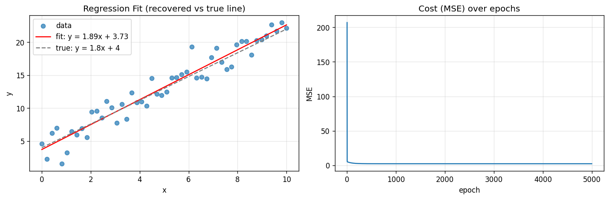
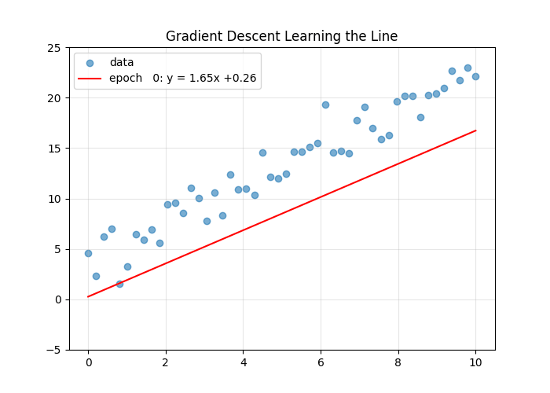

# Linear Regression from Scratch

Trained linear regression using **gradient descent** — written from scratch, **no sklearn**.

## Live Results

The fit vs the true line, and the cost dropping over epochs (trained in Colab):



Gradient descent learning the line, animated:



## Metrics from the run

| Metric | Value |
|--------|-------|
| Learned slope | ~1.8 (true: 1.8) |
| Learned intercept | ~4.0 (true: 4.0) |
| Notebook | [open it](linear_regression_from_scratch.ipynb) |

## The Math

**Model:** `y_pred = w * X + b`

**Cost (MSE):** `J = (1/n) * sum((y_pred - y)^2)`

**Gradients:**

```
dw = (2/n) * sum(X * (y_pred - y))
db = (2/n) * sum(y_pred - y)
```

**Update rule (gradient descent):**

```
w = w - lr * dw
b = b - lr * db
```

## How it works

1. Start with `w = 0`, `b = 0`
2. Predict with current weights
3. Compute the error
4. Take the gradient of the cost w.r.t `w` and `b`
5. Nudge the weights in the direction that reduces error
6. Repeat for `epochs` iterations

## Run it yourself

```bash
pip install numpy matplotlib
# option 1: script
python example.py
# option 2 (proof): open linear_regression_from_scratch.ipynb in Google Colab and Run All
```

## Files

- `linear_regression_from_scratch.ipynb` — Colab notebook with the full training run (outputs + plots saved)
- `linear_regression.py` — the model class
- `example.py` — CLI demo